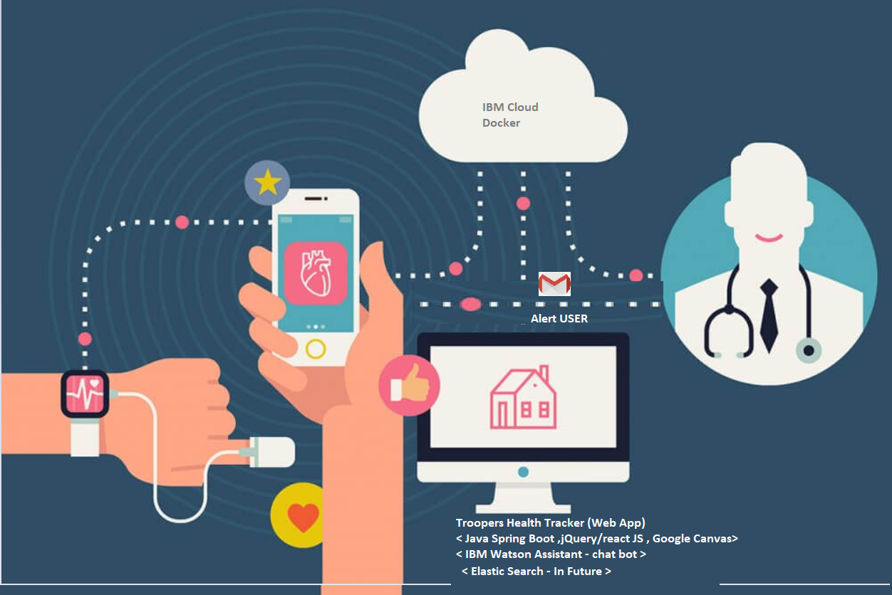

<h1 align="center" style="border-bottom: none;">🚀 Troopers HealthTracker Application</h1>
<h3 align="center">This is a Java + Spring Boot 2 Application intergrated with IBM Watson assistance base on Javascript demonstration app</h3>

<p align="center">
  <a href="http://travis-ci.org/watson-developer-cloud/assistant-simple">
    
  </a>
</p>
</p>

## Contents

1. [Short description](#short-description)
1. [Demo video](#demo-video)
1. [The architecture](#the-architecture)
1. [Long description](#long-description)
1. [Project roadmap](#project-roadmap)
1. [Getting started](#getting-started)
1. [Running the tests](#running-the-tests)
1. [Live demo](#live-demo)
1. [Built with](#built-with)
1. [Contributing](#contributing)
1. [Versioning](#versioning)
1. [Authors](#authors)
1. [License](#license)
1. [Acknowledgments](#acknowledgments)

## Short description

### What's the problem?

Part of the World Health Organization's guidance on limiting further spread of COVID-19 is to practice social distancing. As a result, schools in most affected areas are taking precautionary measures by closing their facilities. With school-aged children at home for an indeterminate amount of time,  keeping them engaged, entertained, and on top of their education is important.

### How can technology help?

Schools and teachers can continue to engage with their students through virtual classrooms, and even create interactive spaces for classes. As parents face a new situation where they may need to homeschool their children, finding appropriate online resources is important as well.

### The idea

It's imperative that learning and creating can continue when educational institutions have to shift the way they teach in times of crises, such as the COVID-19 pandemic. Providing a set of open source tools, backed by IBM Cloud and Watson Services, will enable educators to more easily make content available for their students.

## Demo video - To be modified

[](https://youtu.be/vOgCOoy_Bx0)

## The architecture  -- To be modified



1. The user navigates to the site and uploads a video file.
2. Watson Speech to Text processes the audio and extracts the text.
3. Watson Translation (optionally) can translate the text to the desired language.
4. The app stores the translated text as a document within Object Storage.

## Long description

[More detail is available here](DESCRIPTION.md)

## Project roadmap


## Getting started

These instructions will get you a copy of the project up and running on your local machine for development and testing purposes. See deployment for notes on how to deploy the project on a live system.

### Prerequisites

1. Sign up for an [IBM Cloud account](https://console.bluemix.net/registration/).
1. Create an instance of the Watson Assistant service and get your credentials:
    - Go to the [Watson Assistant](https://console.bluemix.net/catalog/services/conversation) page in the IBM Cloud Catalog.
    - Log in to your IBM Cloud account.
    - Click **Create**.
    - Click **Show** to view the service credentials.
    - Copy the `apikey` value, or copy the `username` and `password` values if your service instance doesn't provide an `apikey`.
    - Copy the `url` value.

## Configuring the application

1. In your IBM Cloud console, open the Watson Assistant service instance

2. Click the **Import workspace** icon in the Watson Assistant service tool. Specify the location of the workspace JSON file in your local copy of the app project:

    `<project_root>/training/bank_simple_workspace.json`

3. Select **Everything (Intents, Entities, and Dialog)** and then click **Import**. The car dashboard workspace is created.

4. Click the menu icon in the upper-right corner of the workspace tile, and then select **View details**.

5. Click the  icon to copy the workspace ID to the clipboard.

    

6. In the application folder, edit the resources/application.properties

    ```
    
    ```

7. Open the application.properties file and add the service credentials that you obtained in the previous step. The Watson SDK automaticaly locates the correct enviromental variables for either `username`, `password`, and `url` or the `apikey` and `url` credentials found in the *.env* file.

    Example *.env* file that configures the `apikey` and `url` for a Watson Assistant service instance hosted in the US East region:

    ```
    ibm.assistant.workspace.id=10c28603-f97a-45b0-b8e3-01512554d582
    ibm.assistant.username=17d5f37a-3022-40a4-9ad6-e456199adb75
    ibm.assistant.password=6lnxVZeaJTc5
    ```

    - If your service instance uses `username` and `password` credentials, add the `ASSISTANT_USERNAME` and `ASSISTANT_PASSWORD` variables to the *.env* file.

    Example *.env* file that configures the `username`, `password`, and `url` for a Watson Assistant service instance hosted in the US South region:

    ```
    
    ibm.assistant.username=17d5f37a-3022-40a4-9ad6-e456199adb75
    ibm.assistant.password=6lnxVZeaJTc5
    ```
    However, if your credentials contain an IAM API key, copy the `apikey` and `url` to the relevant fields.
    ```JSON
      {
        "apikey": "ca2905e6-7b5d-4408-9192-e4d54d83e604",
        "iam_apikey_description": "Auto generated apikey during resource-key ...",
        "iam_apikey_name": "auto-generated-apikey-62b71334-3ae3-4609-be26-846fa59ece42",
        "iam_role_crn": "crn:v1:bluemix:public:iam::::serviceRole:Manager",
        "iam_serviceid_crn": "crn:v1:bluemix:public:iam...",
        "url": "https://gateway-syd.watsonplatform.net/assistant/api"
      }
    ```
    ```
    ASSISTANT_IAM_APIKEY=ca2905e6-7b5d-4408-9192-e4d54d83e604
    ASSISTANT_IAM_URL=https://gateway-syd.watsonplatform.net/assistant/api
    ```

8. Add the `WORKSPACE_ID` to the previous properties

    ```
    ibm.assistant.workspace.id=10c28603-f97a-45b0-b8e3-01512554d582
    ```

## Running locally

1. Install the dependencies

    ```
    maven clean
    ```

1. Run the application

    ```
    maven install
    ```

1. View the application in a browser at `localhost:8080

## Running the tests

Explain how to run the automated tests for this system

## Live demo - to be modify

You can find a running system to test at [callforcode.mybluemix.net](http://callforcode.mybluemix.net/)

## Built with - to be modify

* [IBM Cloudant](https://cloud.ibm.com/catalog?search=cloudant#search_results) - The NoSQL database used
* [IBM Cloud Functions](https://cloud.ibm.com/catalog?search=cloud%20functions#search_results) - The compute platform for handing logic
* [IBM API Connect](https://cloud.ibm.com/catalog?search=api%20connect#search_results) - The web framework used
* [Dropwizard](http://www.dropwizard.io/1.0.2/docs/) - The web framework used
* [Maven](https://maven.apache.org/) - Dependency management
* [ROME](https://rometools.github.io/rome/) - Used to generate RSS Feeds

## Contributing

Please read [CONTRIBUTING.md](CONTRIBUTING.md) for details on our code of conduct, and the process for submitting pull requests to us.

## Versioning

We use [SemVer](http://semver.org/) for versioning. For the versions available, see the [tags on this repository](https://github.com/your/project/tags).

## Authors

See also the list of [contributors](https://github.com/Code-and-Response/Project-Sample/graphs/contributors) who participated in this project.

## License

This project is licensed under the Apache 2 License - see the [LICENSE](LICENSE) file for details

## Acknowledgments

* Based on [Billie Thompson's README template](https://gist.github.com/PurpleBooth/109311bb0361f32d87a2).


