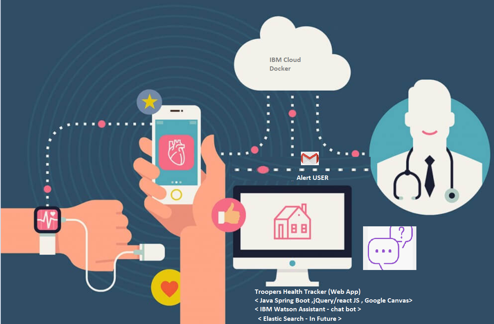
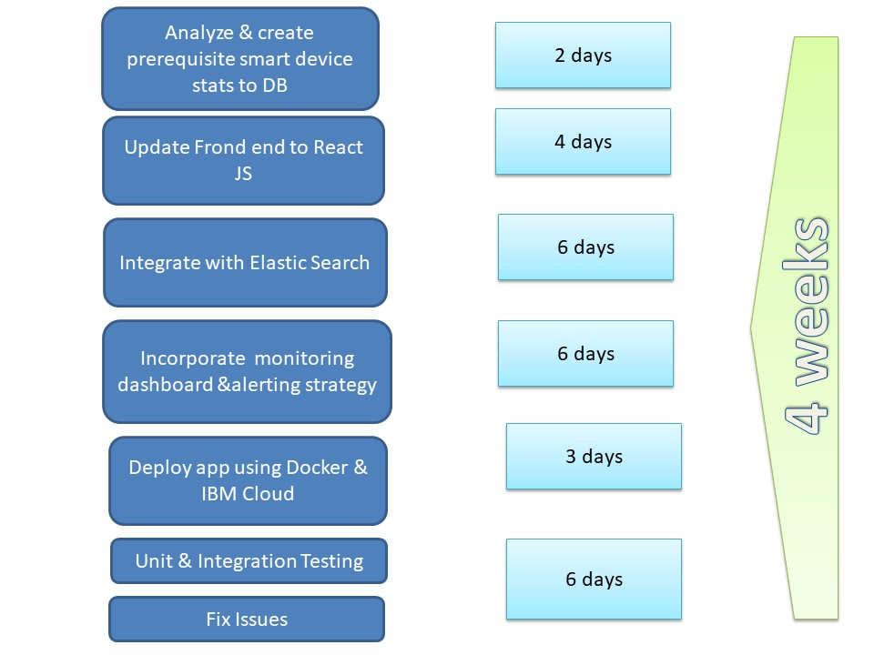
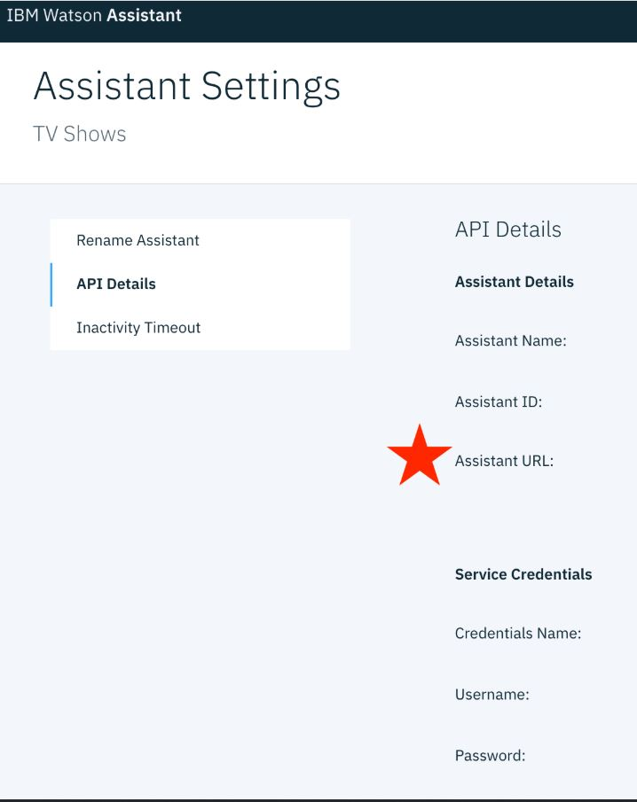
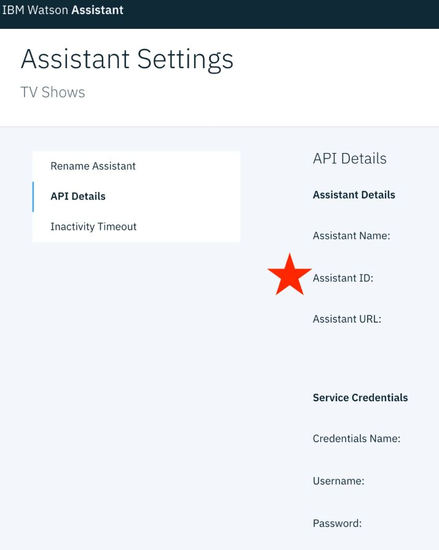

<h1 align="center" style="border-bottom: none;"> Troopers HealthTracker Application</h1>
<h3 align="center">This is a Java + Spring Boot 2 Application intergrated with IBM Watson assistance base on Javascript demonstration app</h3>

<p align="center">
  <a href="http://travis-ci.org/watson-developer-cloud/assistant-simple">
    
  </a>
</p>
</p>

## Contents

1. [Short description](#short-description)
1. [Demo video](#demo-video)
1. [The architecture](#the-architecture)
1. [Long description](#long-description)
1. [Project roadmap](#project-roadmap)
1. [Getting started](#getting-started)
1. [Running the tests](#running-the-tests)
1. [Live demo](#live-demo)
1. [Built with](#built-with)
1. [Contributing](#contributing)
1. [Versioning](#versioning)
1. [Authors](#authors)
1. [License](#license)
1. [Acknowledgments](#acknowledgments)

## Short description

### What's the problem?

Every pandemic brings a challenge in healthcare where connecting the doctors with patients with accurate and relevant info is very critical to cure the patients and stop the spread of the pandemic.

### How can technology help?

As social distancing has become the norm, we will need virtual connect to sustain us. Connecting Patients and Doctors by providing a platform for chat rooms and frequent virtual health checks when unusual symptoms are observed is essential.

### The idea

An application where medical professionals will be monitoring patient’s health information (hourly/daily/weekly) from time to time through a smart device/ Manual process.
Based on patient’s health, medical professionals will take necessary actions like advising prescription, connect via chat bot ,suggestions for clinical tests, physical visit..etc 
Thus Trooper Health Tracker will help to maintain medical professionals -Patient relation by social distancing

## Demo video
Link to Webex Recording :   https://optum.webex.com/optum/ldr.php?RCID=528ba4e54a422ea613804bf7f7ee66a0


## The architecture



1. The patients daily stats are collected and stored in DB through a device or by manual entry.
2. When a patient/admin user logins into an app, corresponding users stats are shown in dashboard.
3. Watson Assistant chatbot is available at admin/patient page to provide support for any queries.
4. Patient have an option to reach out to Doctor by providing the symptoms through an automated email.
5. Doctor suggests Patient by providing prescription based on symptoms, if it is urgent patient needs to admit in hospital.

## Long description

[More detail is available here](readme_files/Description.md)

## Project roadmap



## Getting started

These instructions will get you a copy of the project up and running on your local machine for development and testing purposes. See deployment for notes on how to deploy the project on a live system.

### Prerequisites

1. Sign up for an [IBM Cloud account](https://console.bluemix.net/registration/).
1. Create an instance of the Watson Assistant service and get your credentials:
    - Go to the [Watson Assistant](https://console.bluemix.net/catalog/services/conversation) page in the IBM Cloud Catalog.
    - Log in to your IBM Cloud account.
    - Click **Create**.
    - Click **Show** to view the service credentials.
    - Copy the `apikey` value, or copy the `username` and `password` values if your service instance doesn't provide an `apikey`.
    - Copy the `url` value.

## Configuring the application

1. In your IBM Cloud console, open the Watson Assistant service instance

2. Click the **Import workspace** icon in the Watson Assistant service tool. Specify the location of the workspace JSON file in your local copy of the app project:

    `<project_root>/training/skill-CDC-COVID-FAQ.json`

3. Select **Everything (Intents, Entities, and Dialog)** and then click **Import**. The covid dashboard workspace is created.

4. Click the menu icon in the upper-right corner of the workspace tile, and then select **View details**.

5. In the application folder, edit the resources/application.properties and add the following fields.

    ```
    ibm.assistant.version.date=
    ibm.assistant.id=
    ibm.assistant.url=
    ibm.api.key=
    ```
6. Find api key, assistant id , assistant url from IBM cloud as shown below.

* `WATSON_API_URL` with the assistant URL of the Assistant Details of your Assistant of Watson Assistant.
> NOTE: Only include the part of the URL up to and including `/api` 
 


* `WATSON_ASSISTANT_ID` with the assistant ID of the Assistant Details of your Assistant of Watson Assistant.



7. Open the application.properties file and add the service credentials that you obtained in the previous step. The Watson SDK automaticaly locates the correct enviromental variables for `url` , `apikey` in the application.properties file.

## Running locally

1. Install the dependencies

    ```
    maven clean install
    ```

1. Run the application

    ```
    ./mvnw spring-boot:run
    ```

1. View the application in a browser at `localhost:8080
2. For Admin login use -  username : admin, password: admin
3. For Patient login use - username : Sheldon,  password:Sheldon

## Running the tests

Explain how to run the automated tests for this system

    ```
    maven clean test
    
    ```

## Live demo - NA

## Built with

* [IBM Watson Assistant](https://cloud.ibm.com/docs/services/assistant?topic=assistant-getting-started#getting-started-tutorial) - The    Chatbot application.
* [Maven](https://maven.apache.org/) - Dependency management
* [SpringBoot] - Used to boot the application.
* [Java] - Backend application
* [Jquery] - Frontend application
* [Google CanvasJS] - Used for Graphical/chart view.

## Contributing

Please read [CONTRIBUTING.md](readme_files/CONTRIBUTING.md) for details on our code of conduct, and the process for submitting pull requests to us.

## Versioning

We use [SemVer](http://semver.org/) for versioning. For the versions available, see the [tags on this repository](https://github.com/your/project/tags).

## Authors

See also the list of [contributors](https://github.com/WIT-Hackathon/Troopers-HealthTracker/graphs/contributors) who participated in this project.

## License

This project is licensed under the Apache 2 License - see the [LICENSE](LICENSE) file for details

## Acknowledgments

* Based on [Billie Thompson's README template](https://gist.github.com/PurpleBooth/109311bb0361f32d87a2).


